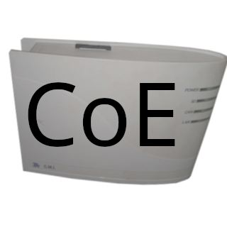

# ioBroker.cmicoe

[](https://www.npmjs.com/package/iobroker.cmicoe)
[](https://www.npmjs.com/package/iobroker.cmicoe)


[](https://nodei.co/npm/iobroker.cmicoe/)

**Tests:** 

## cmicoe adapter for ioBroker

Adapter to communicate with the CMI by Technische Alternative via CoE

### DISCLAIMER

This application is an independent product and is not affiliated with, endorsed by, or sponsored by Technische Alternative. All trademarks, logos, and brand names are the property of their respective owners.
This application is designed to work with the C.M.I. but is not an official product of Technische Alternative. Compatibility with all versions of the device cannot be guaranteed.

## Installation

After installing the adapter open the configuration and put in the ip address of the C.M.I. and you should already receive data from the C.M.I.
**Note: you cannot create two instances of this adapter, because it has to bind to the local port 5442!**
To receive data you have to create a CoE output on the CMI webpage and then the data is displayed in the iobroker state ```in.node<node>.<analog|digital><output>```, e.g. ```in.node25.analog3```.
To send data the outputs have to be specified in the configuration. Enter all the nodes comma-seperated like this: ```<node>/<a|d><out>```, e.g. ```25/d1,25/a2```
Additionally the interval in which the values are sent can be specified and if the data should also be sent if it has changed.

## Changelog
### 1.0.2 (2025-08-13)
* fixed degree, cubic meter symbol

### 1.0.1 (2025-08-13)
* fixed adapter crash on first start

### 1.0.0 (2025-08-13)
* improved config ui
* added support for units
* added support for names and descriptions for inputs/outputs
* BREAKING: state names now contain names from config

### 0.3.1 (2025-02-18)
* fix: negative values crashed adapter

### 0.3.0 (2025-02-17)
* added support for multiple messages in one packet (receiving and sending)
* added error handling

### 0.2.0 (2025-02-17)
* created bind and port options

### 0.1.2 (2025-02-17)
* downgrade to node 18
* create channel/devices before states
* performance improvements

### 0.1.1 (2025-02-16)
* improved log messages
* added log message if address/ip are already in use (probably two instances started)

### 0.1.0 (2025-02-16)
* (FreDeko) initial release

## License
MIT License

Copyright (c) 2025 FreDeko <freddegenkolb@gmail.com>

Permission is hereby granted, free of charge, to any person obtaining a copy
of this software and associated documentation files (the "Software"), to deal
in the Software without restriction, including without limitation the rights
to use, copy, modify, merge, publish, distribute, sublicense, and/or sell
copies of the Software, and to permit persons to whom the Software is
furnished to do so, subject to the following conditions:

The above copyright notice and this permission notice shall be included in all
copies or substantial portions of the Software.

THE SOFTWARE IS PROVIDED "AS IS", WITHOUT WARRANTY OF ANY KIND, EXPRESS OR
IMPLIED, INCLUDING BUT NOT LIMITED TO THE WARRANTIES OF MERCHANTABILITY,
FITNESS FOR A PARTICULAR PURPOSE AND NONINFRINGEMENT. IN NO EVENT SHALL THE
AUTHORS OR COPYRIGHT HOLDERS BE LIABLE FOR ANY CLAIM, DAMAGES OR OTHER
LIABILITY, WHETHER IN AN ACTION OF CONTRACT, TORT OR OTHERWISE, ARISING FROM,
OUT OF OR IN CONNECTION WITH THE SOFTWARE OR THE USE OR OTHER DEALINGS IN THE
SOFTWARE.
